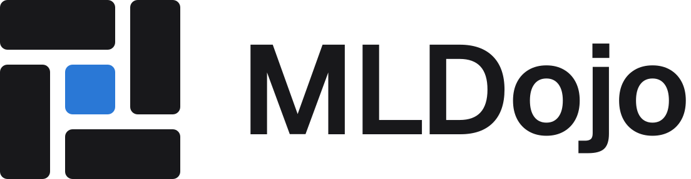
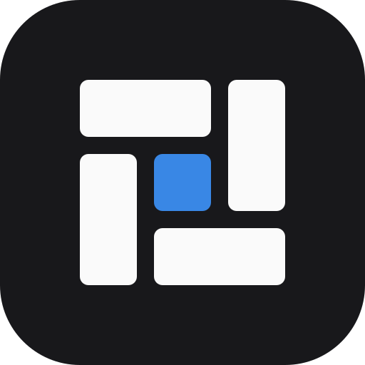

English | [简体中文](README.zh-CN.md)

# MLDojo Logo

## Concept: yojōhan (four and a half mats)

The floor of a dojo is covered with tatami. The mark is taken from the most classic layout, the "four and a half
mat" (yojōhan): four full mats arranged like a pinwheel around a half mat in the middle.

| Element | Meaning |
|---|---|
| Four full mats | Four kinds of compute: local / SSH / command-line queues / external cloud. MLDojo doesn't tie you to a framework and doesn't build its own scheduler; it just organizes them |
| Central half mat (blue) | The Run. Everything in the platform revolves around one training run: organize it, run it, record it |
| Clockwise pinwheel | The iteration loop: submit → train → compare → submit again |
| No point where four corners meet | This layout is called *shūgi-jiki*, the auspicious layout, symbolizing a stable structure |

## Construction

- 3×3 grid: cell U=80, gap G=24, corner radius R=12. A full mat is 184×80, a half mat 80×80, and the whole mark
  288×288.
- App icon: 512 canvas, background `#18181b`, corner radius 112. The mark is centered (112–400), inside the PWA
  maskable safe zone (40% radius).
- Wordmark: Geist SemiBold (SIL OFL 1.1), letter spacing -0.02em, converted to paths. Cap height is 50% of the mark
  height, and the gap between mark and wordmark is 1/3 of the mark width.

## Colors

Consistent with `--primary` and `--chart-1` in `web/app/globals.css`.

| Use | Light background | Dark background |
|---|---|---|
| Mats / wordmark | `#18181b` | `#fafafa` |
| Run (half mat) | `#2a78d6` | `#3987e5` |

## Files

| File | Use |
|---|---|
| `lockup.svg` / `lockup-dark.svg` | Mark + wordmark, transparent background |
| `showcase.png` | Showcase image |
| `web/public/icons/mark.svg` / `mark-dark.svg` | Mark, transparent background, for light / dark backgrounds (Web sidebar, login page) |
| `web/public/icons/icon.svg`, `icon-*.png` | App icon / PWA icon / favicon, also the icon on the Conductor project card |

`web/public/icons/*` is generated by `npm run icons` (`web/scripts/gen-icons.mjs`).

## Usage rules

- Only the central half mat is blue. Where only one color is possible (print, engraving), use a single color
  throughout.
- Don't rotate or mirror it (the pinwheel always turns clockwise), and don't change the mat proportions or gaps.
- Minimum size: 16px for the mark, 20px height for the lockup.
- Keep at least 1U of clear space around it (about 28% of the mark width).
